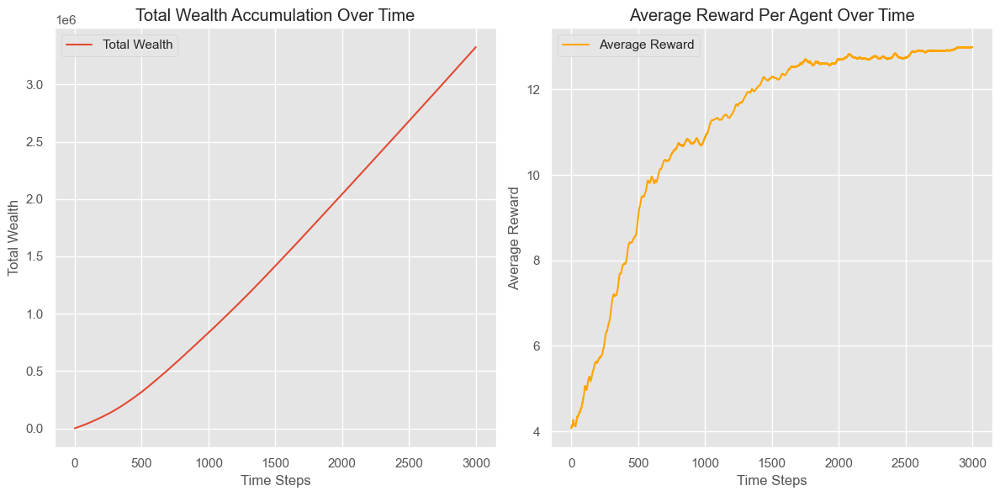
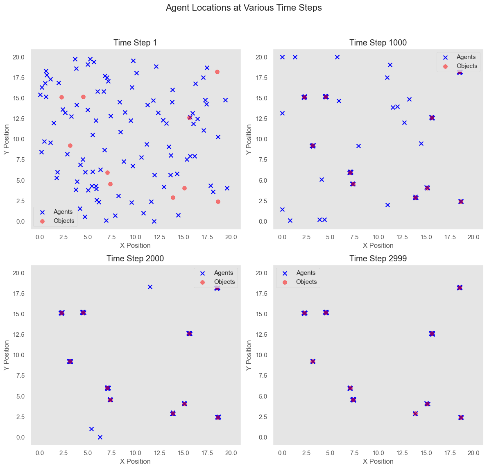
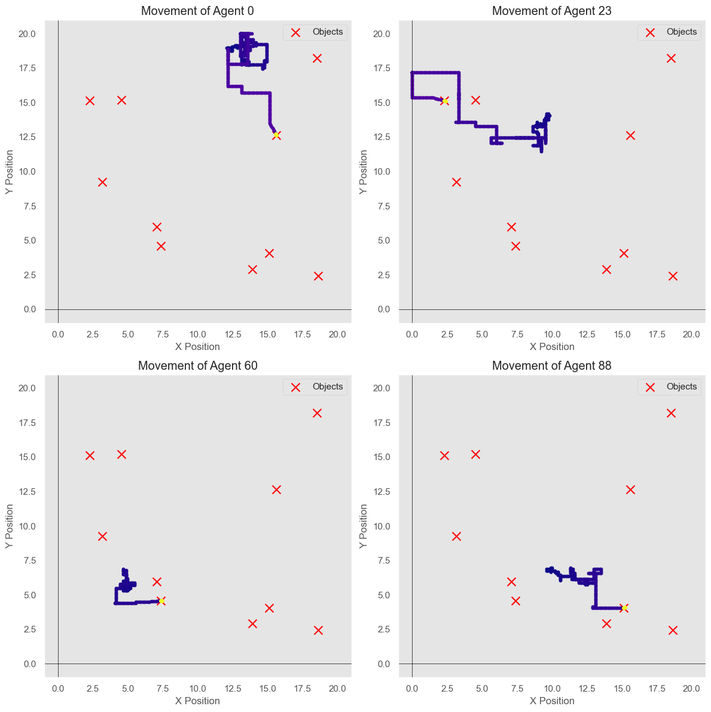

# Exploring Reinforcement Learning in Agent-Based Modeling
{:.no_toc}

## Table of contents
{: .no_toc .text-delta }

1. TOC
{:toc}

---

## Topic and Problem Description

Understanding the allocation of resources such as schools, hospitals, and public services is crucial in addressing socio-economic issues. In urban planning, it's vital to ensure that people have adequate access to these essential resources. The challenge lies in creating a model that can simulate how agents—representing individuals or families—navigate their environment and make decisions based on their proximity to these resources. This is where reinforcement learning (RL) can play a transformative role.

## Real-Life Comparison

Imagine a city where families are trying to choose housing locations based on the proximity to schools, hospitals, and parks. Families with children may prioritize living near good schools, while elderly individuals might look for access to healthcare facilities. By simulating this behavior, we can better understand the dynamics of resource allocation and how different socio-economic factors influence where people choose to live.

## Purpose of the Study

The objective of this project is to develop a reinforcement learning framework that allows agents to intelligently adapt their strategies when searching for housing near important resources. By simulating these behaviors, we aim to gain insights into optimal resource placement and how to reduce disparities in access to essential services. This research contributes to more effective urban planning and resource allocation strategies.

## Algorithm Description

Our approach employs a Q-learning algorithm within an agent class, structured as follows:

  1. **State Representation**: Each agent \\( i \\) at time \\( t \\) is represented by its position in a continuous grid:
   $$
   \mathbf{s}_i(t) = (x_i(t), y_i(t))
   $$

  2. **Q-Table Initialization**: Each agent maintains a Q-table that encodes its knowledge of state-action values:
   $$
   Q: \mathbb{R}^{(G \times 10) \times (G \times 10) \times 4}
   $$
   where \\( 4 \\) corresponds to the available actions: left, right, up, and down.

  3. **Action Selection**: Agents select actions based on an exploration-exploitation strategy:
   $$
   a_i(t) = 
   \begin{cases} 
   \text{random} & \text{with probability } \epsilon(t) \\ 
   \arg\max_a Q(\mathbf{s}_i(t), a) & \text{otherwise}
   \end{cases}
   $$

  4. **Movement Mechanics**: Agents are encouraged to move towards the nearest resource while also avoiding edges of the grid.

  5. **Reward Calculation**: The reward function includes:
   - **Exploration Bonus**: Encouraging agents to explore their environment.
   - **Proximity Reward**: Higher rewards for being closer to essential resources.
   $$
   r_i(t) = r_{exploration} + \sum_{j=1}^{M} R_{proximity}(d_{ij}) + R_{zone}(d_{ij})
   $$

  6. **Q-value Update**: The Q-value for each action is updated based on the rewards received:
   $$
   Q(\mathbf{s}_i(t), a_i(t)) \leftarrow Q(\mathbf{s}_i(t), a_i(t)) + \alpha \left( r_i(t) + \gamma \max_a Q(\mathbf{s}_i(t + 1), a) - Q(\mathbf{s}_i(t), a_i(t)) \right)
   $$

The following plots show the accumulated total wealth of the agents, the average rewards per iteration, and the paths of the agents at different time steps compared to the locations of the objects.

## Conclusion

This project utilizes reinforcement learning to empower agents in navigating a simulated urban environment. By understanding how agents allocate their locations based on access to essential resources, we can devise better strategies for urban planning and resource distribution. This study not only enhances the field of agent-based modeling but also informs future decisions in socio-economic policy-making and resource allocation. Through this approach, we aim to create a more equitable distribution of essential services and improve overall quality of life for urban residents.